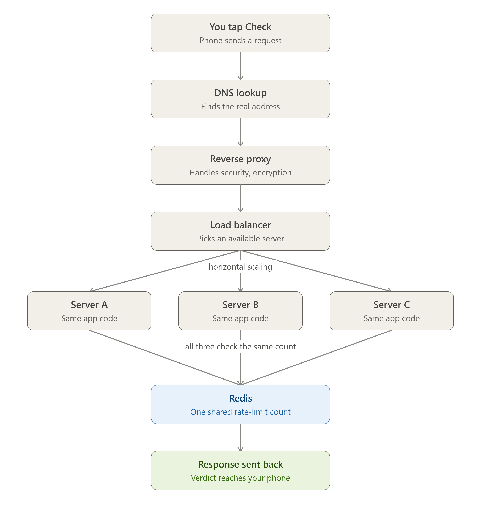

# Prahari — Digital Public Safety Intelligence System

A working, demo-ready prototype that shifts fraud defence from **point of complaint** to
**point of contact** — equipping citizens, banks, and law enforcement with proactive tools to
detect digital-arrest scams, phishing links, voice fraud, and coordinated fraud networks in real time.

Built for the *Digital Public Safety Intelligence* challenge (digital-arrest scams, fraud-network
graph intelligence, geospatial crime mapping, multi-channel citizen shield).

---

## Why this matters

India logged 1.14M cybercrime complaints in 2023; "digital arrest" scams alone defrauded citizens
of ₹1,776 cr in the first nine months of 2024. The gap isn't post-incident evidence — it's
**intelligence before mass victimisation**. Prahari attacks that gap on four fronts at once:
message/voice classification, live session escalation, link safety, and fraud-network graphs,
fused into auditable case files.

---

## Quick start (zero dependencies)

The default server runs on the Python **standard library only** — no install, works fully offline
(a hard requirement for field/edge deployment).

```bash
cd safety_system
python3 -m api.server 8000        # serves API + frontend
# open http://localhost:8000
```

Run the test suite:

```bash
python3 run_tests.py              # 15 checks across all 7 modules
```

### Optional: FastAPI / production ASGI

```bash
pip install -r requirements.txt
uvicorn api.app_fastapi:app --port 8000     # adds OpenAPI docs at /docs
```

---

## The 7 modules

| # | Module | What it does | Tech |
|---|--------|--------------|------|
| 1 | **Scam Detection Engine** | SAFE / SUSPICIOUS / FRAUD with score + explanation. Hinglish/Hindi/English. | TF-IDF (word + char n-grams) + Logistic Regression, fused with a rule-override layer + benign-context guard |
| 2 | **Active Session Detector** | Tracks an ongoing interaction; flags ACTIVE SCAM + severity (LOW/HIGH/CRITICAL) as urgency escalates. | In-memory sliding window (Redis-swappable) |
| 3 | **Fraud Graph Intelligence** | Maps phones/accounts/devices into rings; finds kingpins (PageRank), mules, shared infra. | NetworkX |
| 4 | **Geo Fraud Layer** | Heatmap + ranked hotspots for patrol prioritisation. | Grid-bucket density clustering |
| 5 | **Link Safety Engine** | SAFE / SUSPICIOUS / DANGEROUS for URLs — spoofing, shorteners, bad TLDs, homoglyphs. | Structural heuristics, offline |
| 6 | **Voice Fraud Detection** | REAL / SUSPICIOUS / FRAUD on call transcripts — isolation, fear, authority, payment coercion. | Script-pattern cues + Module 1 |
| 7 | **Case File Generator** | Auditable intelligence package per detection: signals, timeline, graph links, SHA-256 integrity hash. | Deterministic JSON (PDF-ready) |

---

## Measured performance (held-out synthetic eval, 308 messages)

```
Precision 0.928   Recall 1.000   F1 0.963
False-positive rate (overall)         7.8%
False-positive rate (hard "DANGER")   0.6%   <- citizen-facing metric
API latency                           ~2.3 ms/request  (target <500 ms)
```

Recall 1.0 means no fraud slips through; the residual false positives land on the softer
"verify before acting" verdict, while the alarming FRAUD label fires on only 0.6% of safe
messages — the metric that matters for a citizen tool.

---

## API reference

| Method | Endpoint | Body | Returns |
|--------|----------|------|---------|
| POST | `/analyze_message` | `{text}` | risk_level, score, reason, signals, recommended_action |
| POST | `/analyze_session` | `{session_id, text}` | active_scam_session, severity, triggers |
| POST | `/analyze_url` | `{url}` | risk_level, score, signals |
| POST | `/analyze_voice` | `{transcript}` | risk_level, score, signals |
| POST | `/graph/add_interaction` | `{src, dst, type, amount}` | node/edge counts |
| GET  | `/graph/analyze` | — | nodes, edges, clusters, central_nodes |
| GET  | `/geo/analyze` | — | heatmap, hotspots |
| POST | `/case/generate` | `{text?, transcript?, url?, session_id?, subject?}` | full case file |
| POST | `/graph/seed`, `/geo/seed` | — | load synthetic demo data |

---

## Architecture

```
                    ┌──────────────── FRONTEND (single file) ────────────────┐
                    │  Citizen Shield  ·  Command Centre  ·  Live Intercept   │
                    └───────────────────────────┬────────────────────────────┘
                                                 │ REST/JSON
                    ┌────────────────────────────▼────────────────────────────┐
                    │        API LAYER  (stdlib http.server / FastAPI)         │
                    └──┬──────┬──────┬──────┬──────┬──────┬──────┬─────────────┘
                       │      │      │      │      │      │      │
                    ┌──▼─┐ ┌─▼──┐ ┌─▼──┐ ┌─▼──┐ ┌─▼──┐ ┌─▼──┐ ┌─▼────┐
                    │ M1 │ │ M2 │ │ M3 │ │ M4 │ │ M5 │ │ M6 │ │  M7  │
                    │scam│ │sess│ │grph│ │geo │ │link│ │voic│ │ case │
                    └──┬─┘ └──┬─┘ └────┘ └────┘ └────┘ └──┬─┘ └──▲───┘
                       └──────┴───────── shared detector ─┘      │
                                  synthetic data (offline) ──────┘
```

Modular by design (`ml/ graph/ geo/ link/ voice/ casefile/ api/ frontend/`); each module runs
and tests standalone. Swap the in-memory stores for Redis/Neo4j without touching interfaces.

---

## How a request actually works

A few infrastructure terms come up constantly once an app leaves your laptop and runs in
production. Here's the plain-language version, tied to what actually happens in this project.

**Server, Render, DNS.** A server is just a computer that's always on, waiting for messages and
ready to answer them. Your laptop, every time you ran `python -m api.server 8000`, *was* a
server — just a fragile one, since it went offline the moment your laptop slept or lost internet.
Render is a company that keeps a computer like that permanently on in a data center, so the app no
longer depends on your laptop at all. Every internet-connected computer has a numeric address (an
IP address); since numbers are hard to remember, we use domain names instead
(`your-app.onrender.com`), and **DNS** (Domain Name System) is the internet's phone book — it
exists purely to answer "I have a name, what's the real address behind it?"

**One button tap, step by step.** Say you tap "Check this" in the app after typing a scam message:

1. **Your phone builds a request** — the message text gets packaged into a small, structured note
   (JSON) addressed to `your-app.onrender.com`, asking "is this a scam?"
2. **Your phone finds the address** — it asks DNS for the real address behind that name and sends
   the request there.
3. **It arrives at Render, not the code yet** — Render's reverse proxy receives it first, checks
   that it's well-formed and properly encrypted (HTTPS), then forwards it to the container running
   the Python code.
4. **The code wakes up and runs** — `api.server`'s `predict()` reads the message, runs it through
   the rules and the ML model, and decides SAFE / SUSPICIOUS / FRAUD.
5. **The code writes an answer** — a structured note back (`risk_level`, `reason`, ...) handed to
   Render.
6. **Render sends it back out** — the same path in reverse, back to the phone.
7. **The phone shows the verdict** — the warning screen, if risk was flagged.

Steps 1–7 typically happen in well under a second.



**Why Redis matters once there's more than one server.** At scale, one server can't handle every
request alone, so a company runs several copies side by side and a **load balancer** sends each
new request to whichever copy is free — normal and necessary. The problem is only in how counting
works underneath. Say the rate limit is "30 requests per minute" and someone sends 90 requests
fast, across three servers (A, B, C):

- *Without a shared counter:* requests 1–30 land on Server A, which counts them 1→30 and correctly
  blocks request 31. But requests 31–60 land on Server B, which has never seen this caller before —
  its own private counter starts fresh at 0 and lets all 30 through. Same again on Server C. Result:
  90 requests got through a "30 per minute" limit, because each server was keeping its own private
  count with no idea what the others had counted.
- *With Redis:* all three servers read and write the same shared counter. It no longer matters
  which server a given request lands on — by request 31, whichever server receives it checks Redis,
  sees 30 entries already recorded for that identity in the last 60 seconds, and blocks it. This is
  exactly the migration this project made in `ratelimit_memory.py` / `webhook/app.py`: both
  deployed processes (`api.server`, `webhook.app`) now check one shared Upstash Redis counter per
  identity instead of two independent per-process ones.

**Vertical vs. horizontal scaling.** Two different answers to "my app is getting too much
traffic":
- *Vertical* — make the one server stronger (more RAM, a faster CPU). Simple, but there's a
  ceiling, and if that one machine goes down, everything goes down with it.
- *Horizontal* — add more servers instead of making one bigger, and split the work between them
  (the three-server scenario above). This is what makes a shared counter necessary in the first
  place — multiple copies need one source of truth, or limits like "30/minute" silently multiply by
  however many copies are running.

**Load balancer and reverse proxy.** A load balancer sits in front of several server copies and
decides which one handles each new request, so no single copy gets overloaded while another sits
idle. A reverse proxy is the more general version of that idea: anything that sits between the
outside world and the real server, passing messages back and forth on its behalf, hiding the real
server from direct exposure and often handling extra jobs like HTTPS encryption along the way — a
load balancer is a reverse proxy whose specific job is spreading traffic across many servers.

---

## Live deployment

Two Render web services, both free tier, both confirmed live:

- **`rakshak-api`** (`api.server`, the Android app's backend) — **https://rakshak-api-l9pq.onrender.com**
- **`rakshak-webhook`** (`webhook.app`, `/whatsapp/webhook` + evidence delivery) — **https://rakshak-webhook.onrender.com**

**Neither URL follows the bare `<service-name>.onrender.com` pattern you'd guess from `render.yaml`** — `rakshak-api` in particular got a random `-l9pq` suffix because the unsuffixed name was already taken by an unrelated third party. Android's `AppSettings.DEFAULT_BASE_URL` is hard-coded to the real, confirmed `-l9pq` URL above; don't "fix" it back to the shorter guess.

**A real incident, fixed 2026-08-08:** migrating rate-limit storage to Upstash Redis (see above) added a hard `raise RuntimeError` in both `ratelimit_memory.py` and `webhook/app.py` if `REDIS_URL` isn't set — and it was only ever added to the local `.env`, never to Render's dashboard. Every deploy after that migration landed crashed on boot (`RuntimeError: REDIS_URL is not set`), silently, because **Render kept serving each service's last-successful build instead of taking it down** — so `/health` stayed green throughout while every new deploy was actually failing. Fixed by adding `REDIS_URL` to both services' Environment tabs directly in the Render dashboard (this is a per-service dashboard setting — it is **not** read from the repo's `.env` or `.env.example`, and there is currently no `render.yaml` env-group wiring it in automatically, so a future service recreated from the blueprint needs this added by hand). **Both redeployed clean and were verified with real traffic** (`/analyze_voice` → live FRAUD verdict; `/whatsapp/webhook` → live Twilio send), not just a green `/health` check.

`.github/workflows/keep-alive.yml` pings both real `/health` endpoints every 10 minutes (plus a manual `workflow_dispatch` trigger) so Render's free-tier ~15-minute inactivity spin-down doesn't add a 40-50s+ cold start to the first real request of the day.

---

## Demo script (90 seconds)

1. **Citizen Shield** — paste a CBI digital-arrest message → instant FRAUD + plain advice; paste a
   real HDFC OTP → SAFE (false-positive guard in action).
2. **Live Intercept** — send the scam sequence; watch severity climb NONE → HIGH → CRITICAL and the
   "telecom + victim alert dispatched" fire *before* money moves.
3. **Command Centre** — Load live intelligence → fraud graph lights up the two kingpins and mules;
   heatmap surfaces Jamtara/Delhi hotspots; one click files an auditable case package.

---

## Production extensions (designed-in, not bolted-on)

- **Redis** session store (interface already isolated in `ml/session.py`).
- **Neo4j** graph backend for cross-jurisdiction scale (NetworkX is the MVP).
- **sentence-transformers** drop-in for the classifier (pipeline keeps the rule layer).
- **Whisper** front-end to feed real audio into Module 6.
- **PDF export** of case files (the dict is already render-ready).
